# Bureaucratic Cohort Swarms
### Pruning Networks by SRNN 
###### Deadline: 28.02.22

## Experimente

### Fixpoint Tests:
    
- [X] Dropout Test 
  - (Macht das Partikel beim Goal mit oder ist es nur SRN)
  - Zero_ident diff = -00.04999637603759766 %
	   
- [ ] gnf(1) -> Aprox. Weight
  - Übersetung in ein Gewichtsskalar
    - Einbettung in ein Reguläres Netz
	
- [ ] Übersetzung in ein Explainable AI Framework
  - Rückschlüsse auf Mikro Netze
	
- [ ] Visualiserung
  - Der Zugehörigkeit 
  - Der Vernetzung
	
- [ ] PCA()
  - Dataframe Epoch, Weight, dim_1, ..., dim_n
  - Visualisierung als Trajectory Cube
	
- [ ] Recherche zu Makro Mikro Netze Strukturen 
  - gits das schon?
  - Hypernetwork?
  - arxiv: 1905.02898
  - Sparse Networks
  - Pruning 

---

### Tasks für Steffen:
- [x] Sanity Check:

  - [x] Neuronen können lernen einen Eingabewert mit x zu multiplizieren?

    | SRNN x*n    3 Neurons            Identity_Func     | SRNN x*n    4 Neurons              Identity_Func  |
    |---------------------------------------------------|----------------------------------------------------|
    | 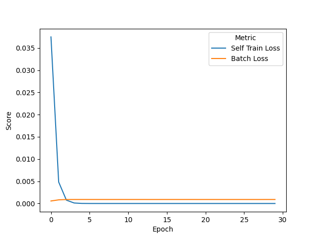   | 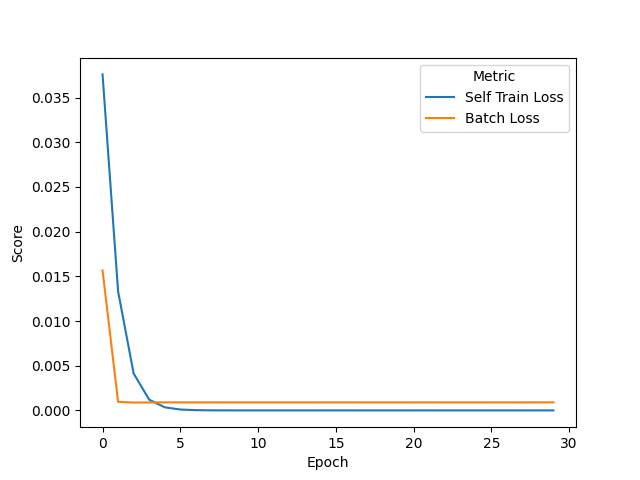  |
    | SRNN x*n    6 Neurons              Other_Func      | SRNN x*n    10 Neurons      Other_Func            |
    | 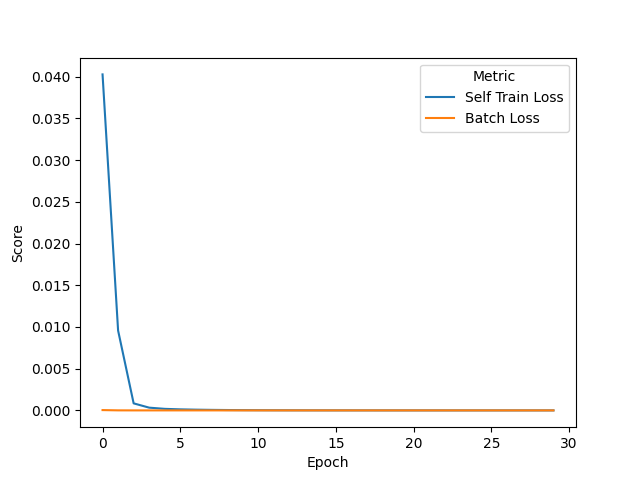   | 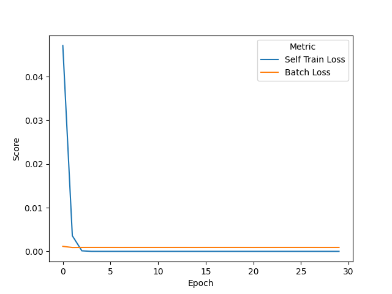 |
  
- [ ] Connectivity
  - Das Netz dünnt sich wirklich aus.
    
    |||
    |---------------------------------------------------|----------------------------------------------------|
    | 200 Epochs - 4 Neurons - \alpha 100     RES     |                                                           |
    | 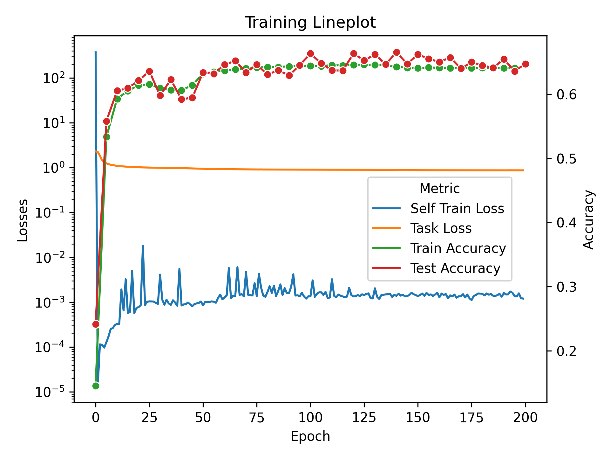 | 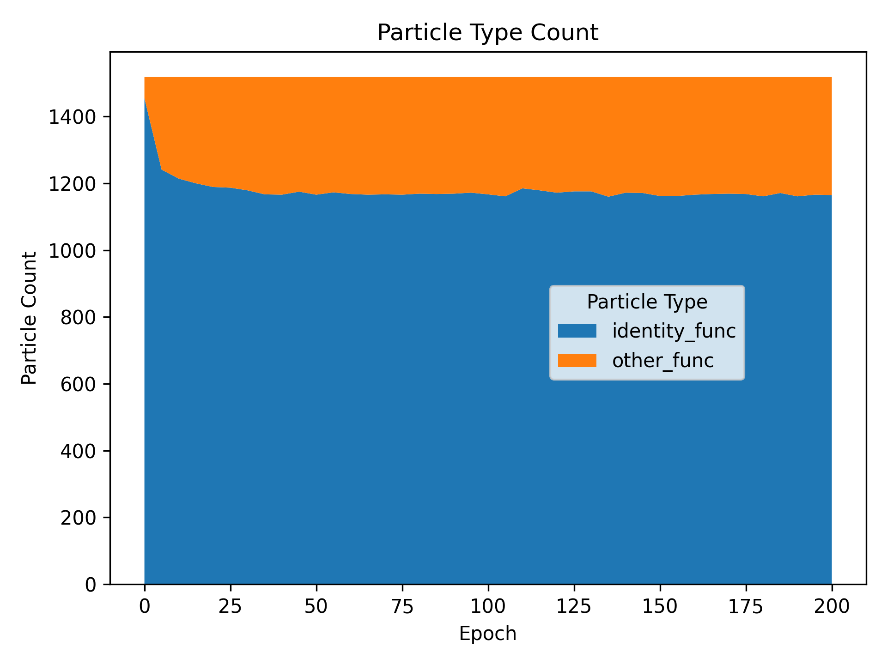 |
    | OTHER FUNTIONS                                    |                  IDENTITY FUNCTIONS                       |
    | 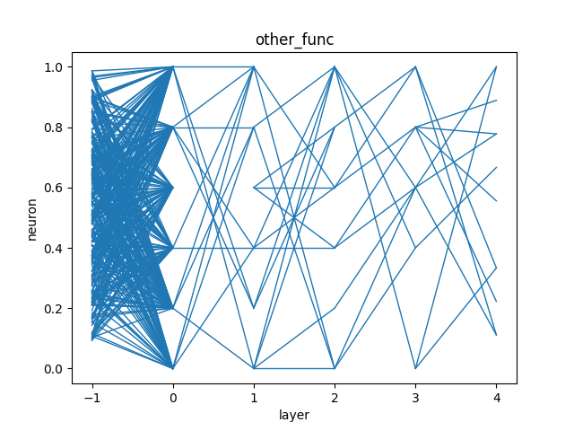             | 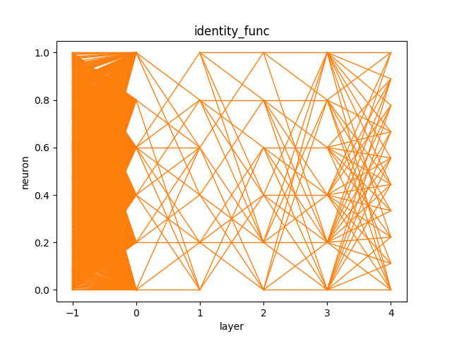                  |

- [ ] Training mit kleineren GNs
  
    
- [ ] Weiter Trainieren -> 500 Epochs?
- [x] Training ohne Residual Skip Connection
  - Ist anders:
     Self Training wird zunächst priorisiert, dann kommt langsam der eigentliche Task durch:
      
      | No Residual Skip connections 8 Neurons in SRNN  Alpha=100                                    | Residual Skip connections 8 Neurons in SRNN    Alpha=100                                 |
      |------------------------------------------------------------------------------------------|----------------------------------------------------------------------------------------------|
      | 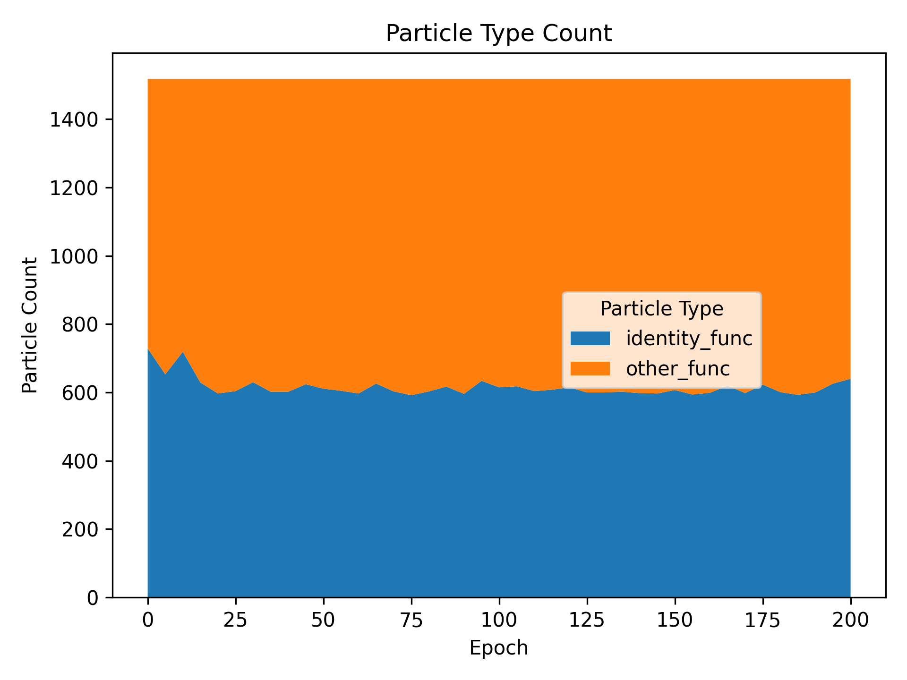 | 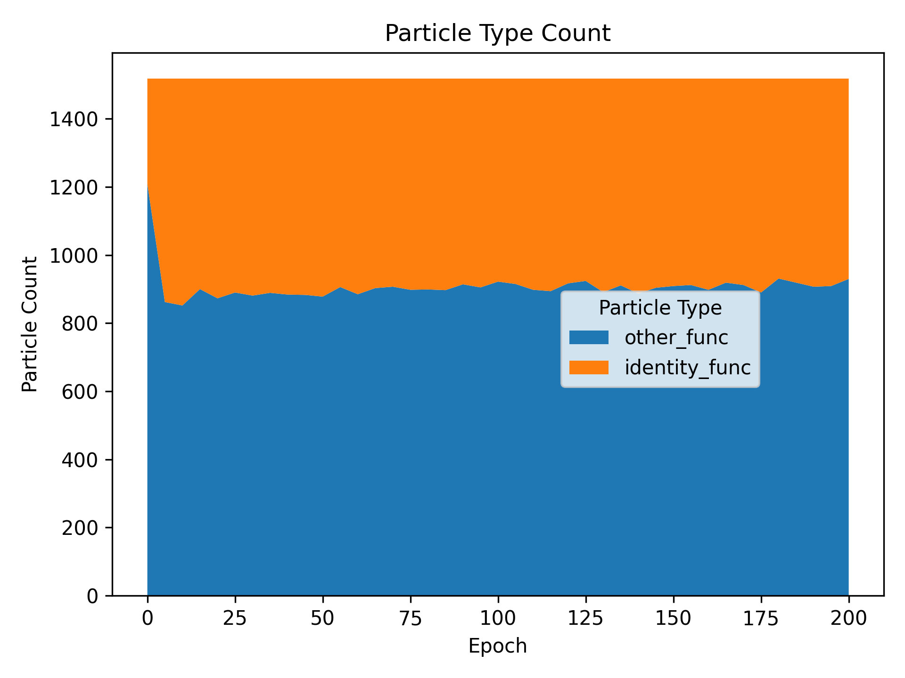  |
      | 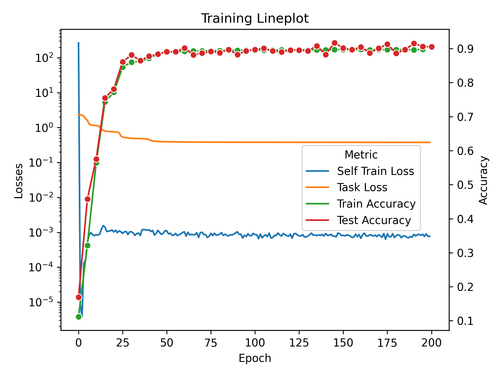       | 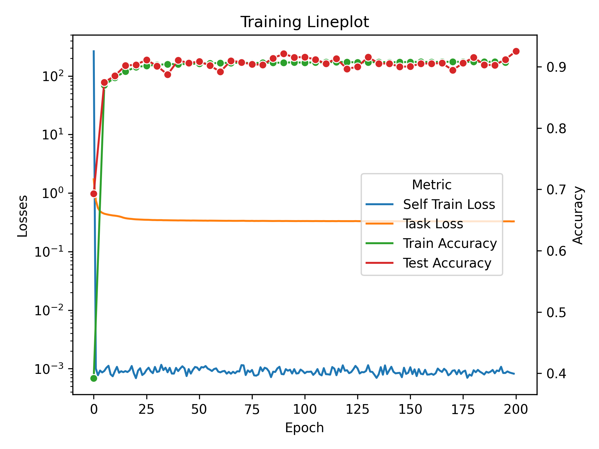          |

- [ ] Test mit Baseline Dense Network 
  - [ ] mit vergleichbaren Neuron Count
  - [ ] mit gesamt Weight Count

- [ ] Task/Goal statt SRNN-Task

---

### Für Menschen mit zu viel Zeit:
- [ ] Sparse Network Training der Self Replication
  - Just for the lulz and speeeeeeed)
  - (Spaß bei Seite, wäre wichtig für schnellere Forschung)
    <https://pytorch.org/docs/stable/sparse.html>

